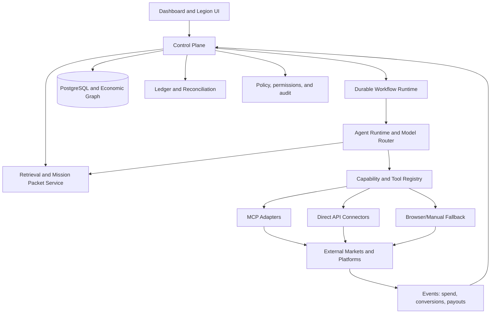

# ARCHITECTURE.md

Source: handoff Section 17, adapted to what actually exists per `CURRENT_STATE.md` and
`CAPABILITY_MATRIX.md`. This describes the target architecture; almost none of it is built yet
(see `PRODUCT_SPEC.md` Section 8 for phasing).

## Separation of concerns

- **Frontend** — a web dashboard (briefing, mission cards, allocation, approvals, ledger views,
  cohort visualization, evidence exploration, marketplace map, monitoring). The MainBrain
  `_shared/style.css` + `Brain{}`/`Charts{}` utilities are a credible visual starting point for a
  read-only prototype (Phase 2), but the real dashboard will need write actions (approve/reject/
  adjust budget) that today's static-HTML pattern cannot support — those require a real backend.
- **Control plane** — a service owning the mission state machine, scoring, budgets, permissions,
  approval gates, connector dispatch, scheduling requests, audit events, data access, and policy
  enforcement. Does not exist yet.
- **Core domain library** — a tested package containing ontology models, scoring functions,
  economics calculations, mission transitions, budget invariants, the retrieval-packet builder,
  connector interfaces, and policy hooks. This is where reusable business logic belongs — not
  inside any one model's prompt or any one platform's workflow (Constitution, Article IX). Does not
  exist yet.
- **MCP/API adapters** — MCP servers expose selected capabilities to agents; they are interfaces,
  not the system of record or the scheduler. Recommended pattern: **core library → internal
  service/API → MCP adapter for model tool use**, so non-Claude workers can call the same
  capabilities. Only generic connectors (Calendar, Drive, GitHub) exist today; no revenue connector
  exists.
- **Workflow runtime** — needs persistence, scheduling, retries, backoff, idempotency,
  cancellation, timeouts, human-approval waits, event history, and concurrency limits. Server-side
  Routines (`create_trigger`) are a real, available scheduling primitive but are **not** a
  full job/state system on their own — see `CAPABILITY_MATRIX.md` and `RISKS_AND_GAPS.md`.
- **Data layer** — PostgreSQL for exact records, a vector store for semantic retrieval, object
  storage for reports/creatives/screenshots, time-series/event tables for market and campaign
  metrics, an optional analytical warehouse as volume grows. None provisioned yet.
- **Event bus/queue** — for new signal, mission state transition, approval, spend event,
  conversion, revenue, connector failure, policy alert, marketplace term change. Not provisioned.
- **Secrets and identity** — a secret vault, per-connector credentials, least privilege, separate
  read/draft/publish/spend scopes, rotation, audit. Never place secrets in prompts, vector stores,
  or logs. Not provisioned — this is a hard blocker before any real connector is wired up.
- **Observability** — job health, connector health, model latency, tool errors, token cost, cash
  spend, revenue, state transitions, unhandled exceptions, duplicate-action prevention, data
  freshness, retrieval quality. Not provisioned.

## Conceptual data flow



## Suggested repository placement

The handoff's own guidance: *"Adapt to the existing second-brain/repository layout rather than
blindly imposing this."* Given `CURRENT_STATE.md`, MainBrain has no backend at all, so imposing the
handoff's full `/apps /services /packages /connectors` layout directly into this repo would
misrepresent it as an application monorepo when it is a static site. Two real options exist and are
tracked as an open question rather than decided unilaterally here — see `OPEN_QUESTIONS.md`:

- **Option A — same repo, new top-level areas.** Add `/services`, `/packages`, `/connectors`
  alongside the existing widget folders, and keep `docs/revenue_os/` (already created) as the
  documentation home. Lowest friction — this repo's GitHub scope is the only repo actually
  reachable in this session — but blurs MainBrain's current "no backend, no build step" identity;
  `CLAUDE.md` would need a rewrite once real code lands here.
- **Option B — separate repository.** Keep MainBrain as the personal dashboard it already is, and
  give Revenue OS its own repo with its own `CLAUDE.md`, deployment target, and database. Cleaner
  separation of concerns, but requires provisioning a new repo and adding it to future sessions via
  `add_repo`.

Documentation for Revenue OS lives at `docs/revenue_os/` in *this* repo for now, since that's where
the handoff was delivered and where James asked the goal to be carried forward. If Option B is
later chosen, this whole folder should move with a pointer left behind, not be duplicated.

```text
docs/revenue_os/
  CONSTITUTION.md
  PRODUCT_SPEC.md
  ARCHITECTURE.md          (this file)
  ONTOLOGY.md
  MARKETPLACE_ATLAS.md
  CAPABILITY_MATRIX.md
  AGENT_CATALOG.md
  SCORING.md
  SECURITY_AND_APPROVALS.md
  DECISIONS.md
  OPEN_QUESTIONS.md
  GLOSSARY.md
  CURRENT_STATE.md
  REUSE_MAP.md
  RISKS_AND_GAPS.md
  schemas/
    signal.schema.json
    marketplace.schema.json
    buyer.schema.json
    opportunity.schema.json
    mission.schema.json
    experiment.schema.json
    capability.schema.json
    connector.schema.json
    evidence.schema.json
    ledger_entry.schema.json
    decision.schema.json
    outcome.schema.json
```

Once Phase 4 (control plane) begins, code should live under new top-level directories (`/services`,
`/packages`, `/connectors`, `/apps/dashboard`), not inside `docs/`.
